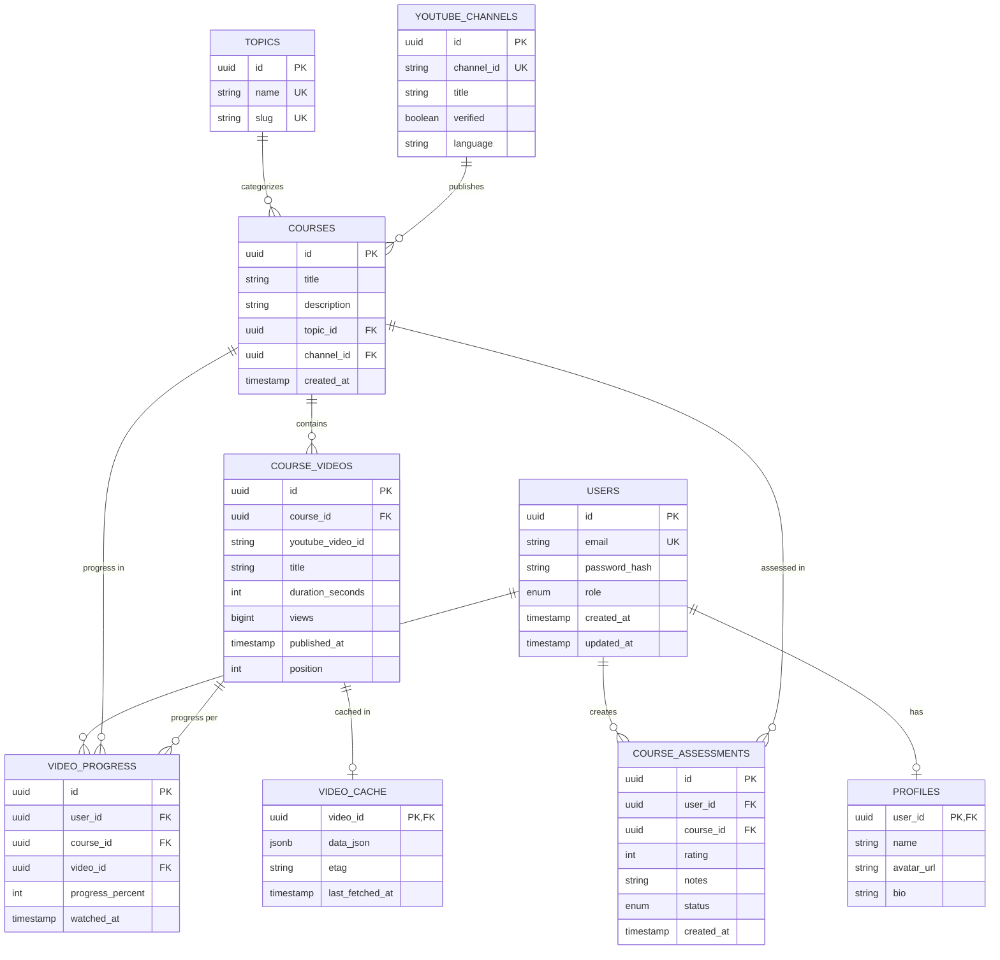

# Relationship Documentation

How entities in the Edu Courses database relate to each other.

---

## Entity Relationship Diagram (Mermaid)

---

## Relationship Summary

| From | To | Cardinality | Description |
|------|-----|-------------|-------------|
| **User** | Profile | 1 : 0..1 | One user has at most one profile (optional). |
| **User** | CourseAssessment | 1 : many | A user can save/assess many courses. |
| **User** | VideoProgress | 1 : many | A user has progress records for many videos. |
| **Topic** | Course | 1 : many | A topic groups many courses. |
| **YoutubeChannel** | Course | 1 : many | A channel is the source of many courses. |
| **Course** | CourseVideo | 1 : many | A course has many videos (playlist). |
| **Course** | CourseAssessment | 1 : many | A course can be saved/assessed by many users. |
| **Course** | VideoProgress | 1 : many | Progress rows reference the course. |
| **CourseVideo** | VideoProgress | 1 : many | Each video can have progress per user. |
| **CourseVideo** | VideoCache | 1 : 0..1 | Optional cache row per video. |

---

## Key Business Rules

1. **User ↔ Profile**  
   One-to-one optional. Profile is created with the user; deleting the user cascades to the profile.

2. **User ↔ Course (via CourseAssessment)**  
   A user can save/assess a course only once: unique `(user_id, course_id)`.  
   “My courses” = all CourseAssessments for that user.

3. **User ↔ Video (via VideoProgress)**  
   One progress row per user per video: unique `(user_id, video_id)`.  
   Used for watch percentage and “recent activity”.

4. **Course ↔ Topic / Channel**  
   Every course has exactly one topic and one YouTube channel.  
   Topic and channel are shared across courses (same topic/channel can have many courses).

5. **Course ↔ CourseVideo**  
   One-to-many; order by `position`.  
   Unique `(course_id, youtube_video_id)` so the same YouTube video is not duplicated in one course.

6. **Cascade deletes**  
   - Delete User → Profile, CourseAssessments, VideoProgress for that user.  
   - Delete Course → CourseVideos, CourseAssessments, VideoProgress for that course.  
   - Delete CourseVideo → VideoProgress, VideoCache for that video.

---

## Navigation Paths (for queries)

| Use case | Path |
|----------|------|
| Current user’s profile | User → Profile |
| “My courses” list | User → CourseAssessment → Course (+ Topic, Channel, video count) |
| Course detail + videos | Course → Topic, Channel, CourseVideo (ordered by position) |
| Dashboard stats | User → count(CourseAssessment), count by status, aggregate(VideoProgress), recent VideoProgress → Video, Course |
| Platform stats | Count Courses, Topics, Users; Topic with course count (top topics) |
